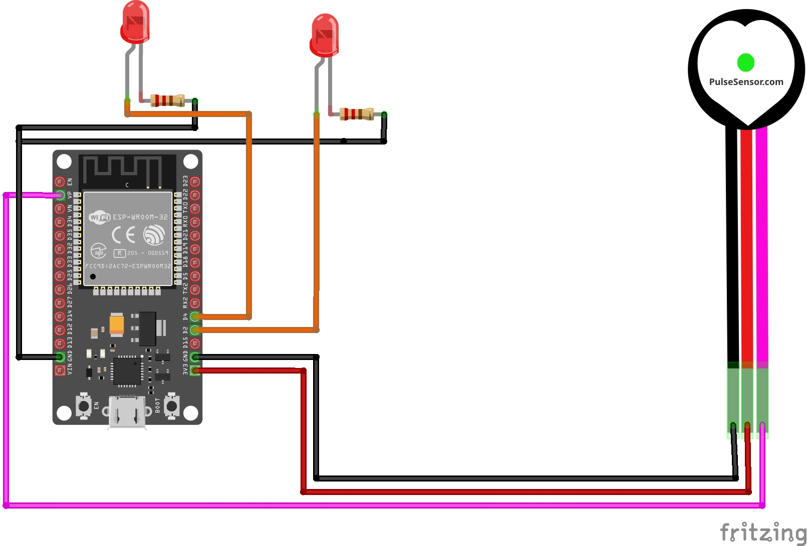

# Pulse Sensor Amped - Guia de Hardware, Processamento de Sinal & Interfaces (Arduino & ESP32)

[](https://www.arduino.cc/)
[](https://www.espressif.com/)
[](https://platformio.org/)
[]()
[](https://opensource.org/licenses/MIT)

Este repositório contém a documentação técnica, análise de engenharia de firmware e guias de migração de arquitetura para o uso do **Pulse Sensor Amped**. O objetivo deste documento é servir como um manual completo para estudantes e entusiastas que desejam implementar processamento de sinal biométrico em tempo real e construir interfaces gráficas (GUIs) com arquitetura modular.

---

## Índice
1. [Documentações e Fontes Originais](#-documentações-e-fontes-originais)
2. [Arquitetura do Projeto](#-arquitetura-do-projeto)
3. [Lista de Materiais (BOM)](#-lista-de-materiais-bom)
4. [Pinagem e Diagrama Elétrico (ESP32)](#-pinagem-e-diagrama-elétrico-esp32)
5. [Como Instalar e Rodar](#-como-instalar-e-rodar)

---

## Documentações e Fontes Originais

Para aprofundamento na física do sensor, calibração óptica e download das ferramentas oficiais de visualização, consulte as fontes que serviram de base para este projeto:

* **Portal Central do Projeto:** [PulseSensor Official Site](https://pulsesensor.com/)
* **Documentação de Hardware e Firmware:** [Repositório PulseSensor Amped Arduino](https://github.com/WorldFamousElectronics/PulseSensor_Amped_Arduino)
* **Software de Interface para Desktop:** [PulseSensor Processing Visualizer GUI](https://github.com/WorldFamousElectronics/PulseSensor_Amped_Processing_Visualizer)
* **Guia de Referência de Engenharia:** [AutoCore Robótica - Blog de Aplicação](https://autocorerobotica.blog.br/utilizando-sensor-de-pulsos-com-arduino/)

---

## Arquitetura do Projeto

O código foi refatorado utilizando princípios de **Programação Orientada a Objetos (POO)** e **Responsabilidade Única (SOLID)**, abandonando a IDE do Arduino em favor do PlatformIO para o ambiente IoT moderno. O firmware original do Arduino, que opera com **Interrupções de Temporizador (Timer Interrupts)** nativas, foi mantido na pasta `arduino/` para fins de legado e estudo de processamento de sinal bruto.

```text
pulse-sensor-amped/
├── 📁 arduino/                  # Ambiente legado (Timer Interrupts nativos)
├── 📁 docs/                     # Diagramas e Lista de Materiais
├── 📁 esp32/                    # Ambiente IoT Moderno (PlatformIO)
│   ├── 📁 data/                 # Interface Front-end (index.html c/ Tailwind)
│   ├── 📁 src/                  # Código C++ Modular
│   │   ├── 📄 main.cpp          # Ponto de entrada limpo
│   │   ├── 📄 SensorProcessing  # Classe de filtro e cálculo de BPM/IBI
│   │   └── 📄 WebServerHandler  # Classe de gestão WiFi, Rotas e WebSockets
│   └── 📄 platformio.ini        # Gerenciador de dependências automáticas
```

---

## 📋 Lista de Materiais (BOM)

Para replicar este projeto voltado ao monitoramento biométrico, você precisará dos seguintes componentes:

| Componente | Qtd | Função no Sistema |
| :--- | :---: | :--- |
| **ESP32 DevKit V1** | 1 | Microcontrolador principal. Processa o sinal ADC e hospeda a GUI no WebServer local. |
| **Pulse Sensor Amped** | 1 | Sensor óptico fotopletismográfico (PPG). |
| **LED 5mm (Verde/Azul)** | 1 | Feedback digital (Pisca a cada pulso detectado). |
| **LED 5mm (Vermelho)** | 1 | Feedback analógico (Efeito *Fade* simulando contração cardíaca). |
| **Resistor 330Ω** | 2 | Proteção de corrente limitadora para os LEDs. |
| **Protoboard & Jumpers** | 1 | Base de montagem física do circuito e roteamento de fiação. |

---

## Pinagem e Diagrama Elétrico (ESP32)



| Pulse Sensor / LEDs | ESP32 (Pinos Sugeridos) | Observação |
| :--- | :--- | :--- |
| Pino **+** (VCC) | `3V3` | Alimentação 3.3V. |
| Pino **-** (GND) | `GND` | Terra comum. |
| Pino **S** (Signal)| `GPIO 36 (VP)` | ADC1_CH0 (Entrada analógica). |
| Anodo LED Blink | `GPIO 2` | Digital Out (Indica o pulso exato). |
| Anodo LED Fade | `GPIO 4` | PWM Out (Efeito de enfraquecimento contínuo). |

---

## Como Instalar e Rodar

Recomenda-se fortemente o uso de uma IDE moderna com suporte a C/C++ e a extensão **PlatformIO** para lidar com o ecossistema do ESP32.

1. **Clone o repositório:**
   ```bash
   git clone [https://github.com/ViniciuscRodrigues/pulse-sensor-amped.git](https://github.com/ViniciuscRodrigues/pulse-sensor-amped.git)
   cd pulse-sensor-amped/esp32
   ```
   
2. **Configure o Wi-Fi:**
   Abra o arquivo `esp32/src/main.cpp` e insira as credenciais da sua rede:
   ```cpp
   const char* WIFI_SSID = "SUA_REDE";
   const char* WIFI_PASS = "SUA_SENHA";
   ```
3. **Faça o Upload do Sistema de Ficheiros (GUI):**
   No PlatformIO, vá ao separador de comandos do projeto (`esp32dev` > `Platform`), clique em **Build Filesystem Image** e, em seguida, em **Upload Filesystem Image**. Isto irá transferir o ficheiro estático `index.html` para a memória Flash (LittleFS) do ESP32.

4. **Faça o Upload do Firmware:**
   Ligue o ESP32 via USB e execute o comando principal de **Upload** para compilar as bibliotecas e enviar o código C++ modularizado.

5. **Aceda à Dashboard:**
   Abra o Monitor Série (baud rate `115200`). Anote o **IP** gerado ao estabelecer a ligação com a rede e introduza esse endereço no seu navegador web para visualizar a dashboard em tempo real.

---

## Referências e Créditos

Este projeto de firmware baseia-se nos estudos biométricos e algoritmos *open-source* idealizados pelos autores originais do hardware:
* **Autores Originais (Hardware):** Joel Murphy e Yury Gitman ([PulseSensor.com](http://www.pulsesensor.com))
* **Firmware Base (Arduino):** [PulseSensor_Amped_Arduino](https://github.com/WorldFamousElectronics/PulseSensor_Amped_Arduino)
* **Desenvolvimento e Refatorização ESP32:** Vinícius Rodrigues
